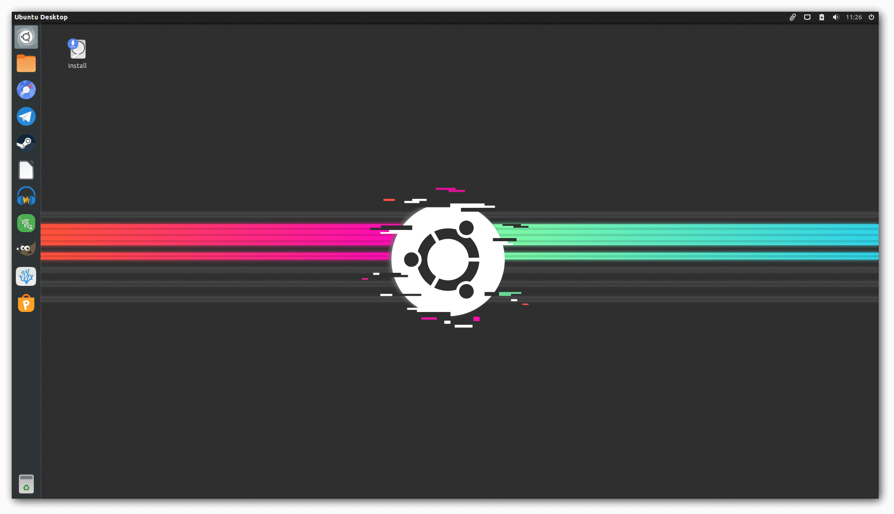
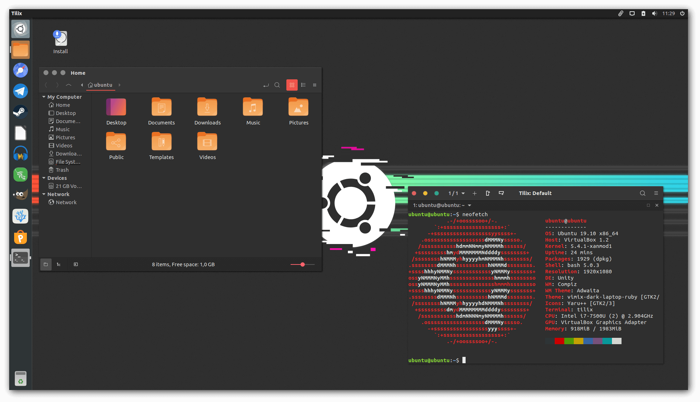

O **Unity eXPerience** é um projeto de prova de conceito, que visa a possibilidade de usar o ambiente gráfico [**Unity**](https://en.wikipedia.org/wiki/Unity_%28user_interface%29) na última versão disponível do _**Ubuntu**_.

O sistema usa como _base_ o [**Ubuntu 19.10**](https://ubuntu.com) e o kernel é o [**XanMod**](https://xanmod.org/).

[](https://sourceforge.net/projects/unity-xp/files/ISO)

[](https://github.com/rauldipeas/Unity-XP/actions?query=workflow%3A%22Unity+XP+%28ISO%29%22)

[](https://github.com/rauldipeas/Unity-XP/actions?query=workflow%3A%22Unity+XP+%28download-counter%29%22)

### Imagens

1 | 2 | 3 | 4 | 5
-|-|-|-|-
[](screenshots/desktop.png)|[](screenshots/epiphany.png)|[](screenshots/tilix+nemo.png)|[](screenshots/apps.png)|[](screenshots/plymouth.png)

### Características
 - [**Ubuntu 19.10**](https://ubuntu.com)
 - Kernel [**XanMod**](https://xanmod.org/)
 - [**ZRAM**](https://en.wikipedia.org/wiki/Zram)
 - [`limits.conf`](https://github.com/rauldipeas/Unity-XP/blob/master/code/settings/limits.conf) otimizado
 - [`sysctl.conf`](https://github.com/rauldipeas/Unity-XP/blob/master/code/settings/sysctl.conf) otimizado
 - [**MESA drivers**](https://launchpad.net/~oibaf/+archive/ubuntu/graphics-drivers)_(ppa:oibaf/graphics-drivers)_
 - [**NVIDIA driver**](https://launchpad.net/~system76/+archive/ubuntu/pop)_(ppa:system76/pop)_
 - [**NVIDIA DRM**](https://github.com/rauldipeas/Unity-XP/blob/master/code/settings/nvidia-drm.conf) ativado por padrão
 - [**NVIDIA force full composite**](https://github.com/rauldipeas/Unity-XP/blob/master/code/settings/nvidia-composite.desktop) ativado por padrão
 - Ambiente de desktop [**Unity 7**](https://en.wikipedia.org/wiki/Unity_%28user_interface%29)

### Lista de programas inclusos:
 - [Activity log manager](https://launchpad.net/activity-log-manager)
 - [AppImageD](https://github.com/AppImage/appimaged)
 - [AppImageLauncher](https://github.com/TheAssassin/AppImageLauncher)
 - [Audacity](https://www.audacityteam.org/)
 - [Boot repair **(live-mode)**](https://sourceforge.net/projects/boot-repair/)
 - [CompizConfig settings manager](https://en.wikipedia.org/wiki/Compiz)
 - [Crow translate](https://crow-translate.github.io/)
 - [Deluge](https://www.deluge-torrent.org/)
 - [Diodon](https://launchpad.net/diodon)
 - [Disks](https://wiki.gnome.org/Apps/Disks)
 - [EmojiOne](https://www.joypixels.com/)
 - [Epiphany(Web)](https://wiki.gnome.org/Apps/Web)
 - [FeedReader](https://jangernert.github.io/FeedReader/)
 - [Ferramenta de captura de tela do GNOME](https://en.wikipedia.org/wiki/GNOME_Screenshot)
 - [FFmpegthumbnailer](https://github.com/dirkvdb/ffmpegthumbnailer)
 - [Folder color Nemo](http://foldercolor.tuxfamily.org/)
 - [GDebI](https://launchpad.net/gdebi)
 - [Gestures](https://gitlab.com/cunidev/gestures)
 - [GIMP](https://www.gimp.org/)
 - [GNOME calculator](https://wiki.gnome.org/Apps/Calculator)
 - [GNOME font viewer](https://launchpad.net/ubuntu/+source/gnome-font-viewer)
 - [GpuTest](https://www.geeks3d.com/20140304/gputest-0-7-0-opengl-benchmark-win-linux-osx-new-fp64-opengl-4-test-and-online-gpu-database/)
 - [gThumb](https://wiki.gnome.org/Apps/Gthumb)
 - [Hardcode-tray](https://github.com/bilelmoussaoui/Hardcode-Tray)
 - [HardInfo](https://www.berlios.de/software/hardinfo/)
 - [Indicator KDEConnect](https://github.com/Bajoja/indicator-kdeconnect)
 - [KColorChooser](https://kde.org/applications/graphics/org.kde.kcolorchooser)
 - [KDEConnect](https://community.kde.org/KDEConnect)
 - [Kvantum](https://github.com/tsujan/Kvantum/tree/master/Kvantum)
 - [LibreOffice(Calc, Draw, Impress e Writer)](https://pt-br.libreoffice.org/)
 - [LightDM GTK greeter](https://launchpad.net/lightdm-gtk-greeter)
 - [Lutris](https://lutris.net/)
 - [MellowPlayer](https://colinduquesnoy.gitlab.io/MellowPlayer/)
 - [Nemo](https://en.wikipedia.org/wiki/Nemo_%28file_manager%29)
 - [Neofetch](https://github.com/dylanaraps/neofetch)
 - [OBS studio](https://obsproject.com/)
 - [Olive](https://www.olivevideoeditor.org/)
 - [Pling store](https://pling.com)
 - [Qt5Ct](https://sourceforge.net/projects/qt5ct/)
 - [RawTherapee](https://rawtherapee.com/)
 - [RClone browser](https://martins.ninja/RcloneBrowser/)
 - [RCloneTray](https://github.com/dimitrov-adrian/RcloneTray)
 - [Redshift GTK](http://jonls.dk/redshift/)
 - [Rygel](https://wiki.gnome.org/Projects/Rygel/)
 - [SAMBA](https://www.samba.org/)
 - [Simple weather indicator](https://simpleweatherindicator.madadipouya.com/)
 - [SMPlayer](https://www.smplayer.info/en/info)
 - [Stacer](https://oguzhaninan.github.io/Stacer-Web/)
 - [Steam](https://store.steampowered.com/about/)
 - [Streamio](https://www.stremio.com/br/)
 - [Synaptic](http://www.nongnu.org/synaptic/)
 - [Telegram](https://telegram.org/)
 - [Tilix](https://gnunn1.github.io/tilix-web/)
 - [TimeShift](https://teejeetech.in/timeshift/)
 - [Unity-tweak-tool](https://launchpad.net/unity-tweak-tool)
 - [Vinagre](https://wiki.gnome.org/Apps/Vinagre/)
 - [Vino](https://help.ubuntu.com/community/VNC/Servers)
 - [VSCodium](https://vscodium.com/)
 - [WINE staging](https://wiki.winehq.org/Wine-Staging)
 - [XBoxDrv](https://xboxdrv.gitlab.io/)
 - [XFCE notifyd](https://docs.xfce.org/apps/notifyd/start)

### Temas
  - [Vimix(GTK)](https://vinceliuice.github.io/theme-vimix.html)
  - [Vimix(Kvantum)](https://github.com/vinceliuice/vimix-kde)
  - [Yaru++(icons)](https://github.com/Bonandry/yaru-plus)
  - [Suru++-Ubuntu(icons, inherits)](https://github.com/Bonandry/suru-plus-ubuntu)
  - [Papirus(icons, inherits)](https://github.com/PapirusDevelopmentTeam/papirus-icon-theme/)
  - [Breeze(Cursor)](https://github.com/KDE/breeze)
  - [Tela(GRUB)](https://github.com/vinceliuice/grub2-themes)
  - [Placidity(Plymouth)](https://www.pling.com/p/1201141/)

### Faça você mesmo
[~~No momento, _**não há a possibilidade de disponibilizar uma imagem de instalação**_, porém,~~](https://github.com/rauldipeas/Unity-XP/releases) você pode _compilar a imagem por sua conta e risco_, usando os comandos _abaixo_:

 - **Instalando as dependências necessárias para compilação**
```bash
sudo apt install apt-transport-https debootstrap grub-efi-amd64-signed mtools squashfs-tools xorriso
```
 - **Baixando os arquivos necessários para a compilação**
```bash
git clone https://github.com/rauldipeas/Unity-XP unity-xp-source
```

 - **Compilando a imagem**
```bash
cd unity-xp-source
bash code/build.sh
```

Após a compilação, a imagem de instalação estará salva aqui: `~/Unity-XP/unity-xp-19.10-amd64.iso`

O tempo de compilação **pode variar**, _**de acordo com a capacidade de processamento do seu hardware e a velocidade da sua internet**_, no meu notebook **IdeaPad-320** com processador **i7 7500U**, **8gb de RAM** e um **SSD**, usando uma conexão de **60mbps**, demora em torno de _30 minutos_.

O programa recomendado pra gravar a imagem no pendrive é o [**Etcher**](https://www.balena.io/etcher/).

Após a instalação do sistema, **para se manter em dia com as atualizações _deste projeto_**, será necessário executar o comando _abaixo_:

```bash
bash <(curl -sL https://git.io/unity-xp-update)
```

Você pode usar as opções `-s` ou `-y` para instalar automaticamente todas as atualizações.